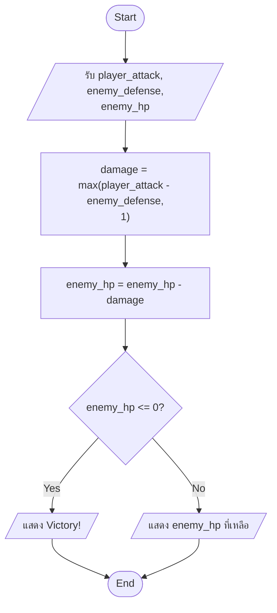
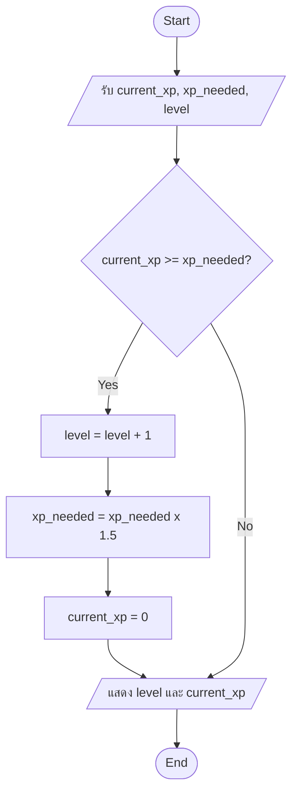
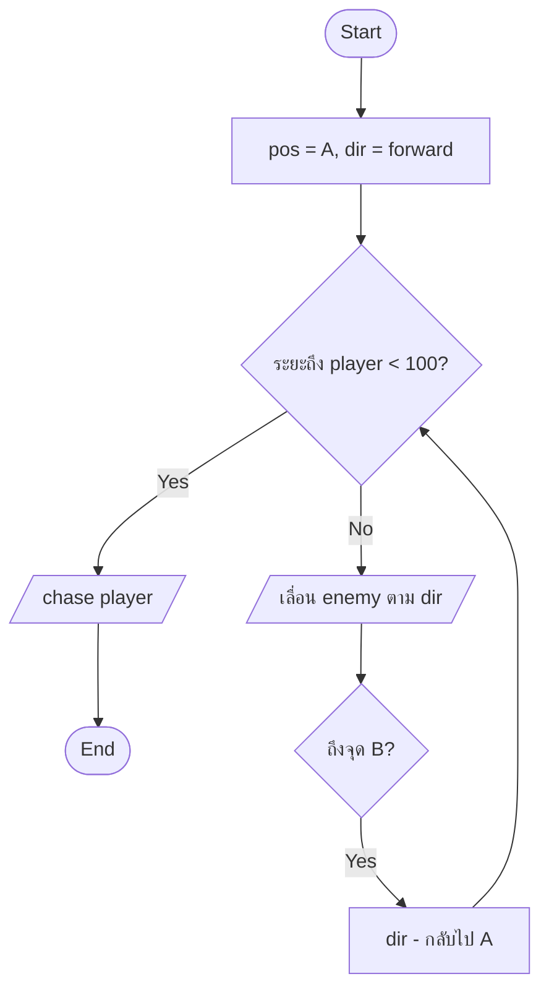

```mermaid
flowchart TD
Start([Start]) --> Input[/รับ player_attack, enemy_defense,
enemy_hp/]
Input --> Calc["damage = max(player_attack - enemy_defense,
1)"]
Calc --> Reduce["enemy_hp = enemy_hp - damage"]
Reduce --> D1{enemy_hp <= 0?}
D1 -->|Yes| Win[/แสดง Victory!/]
D1 -->|No| Show[/แสดง enemy_hp ที่เหลือ/]
Win & Show --> End([End])
```

---

```mermaid
flowchart TD
Start([Start]) --> Input[/รับ current_xp, xp_needed, level/]
--> D1{current_xp >= xp_needed?}
D1 -->|Yes| a[level = level + 1 ]
--> b[ xp_needed = xp_needed x 1.5 ]
--> c[ current_xp = 0]  
--> d[/แสดง level และ current_xp/] 
 --> End([End]) 
D1 -->|No| d[/แสดง level และ current_xp/] 
	   
```

---

```mermaid
flowchart TD
Start([Start]) 
 --> a["pos = A, dir = forward"]
--> D1{ระยะถึง player < 100?}
D1 -->|Yes| Win[/chase player/]
--> End([End])
D1 -->|No| Show[/เลื่อน enemy ตาม dir/]
--> D2{ถึงจุด B?}
 -->|Yes| D["dir - กลับไป A"]
D-->D1


 


```
